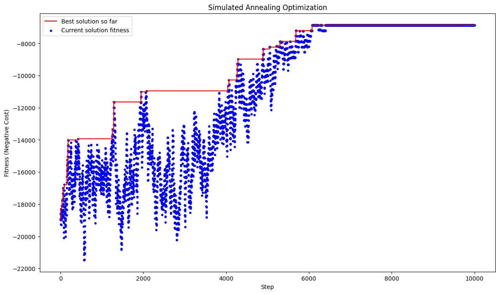

# CI2024_lab1

Initially, I tried a greedy approach, where I iteratively selected the set that covered the largest portion of the universe at each step.
After selecting a set, I would continue by finding the largest remaining set until the union of the selected sets was sufficient to cover the entire universe.

Although the solutions were optimal, the computation time was excessive.
Therefore, inspired by the HC (Hill Climbing) algorithm developed during the lessons,i tryed a simulated annealing approach. The results were sufficiently good and comparable to those obtained with hill climbing.

However, there is certainly room for improvement, particularly in refining the calculation of the temperature and the cooling rate. In this implementation, I adopted a similar approach to the one used in the HC, following the 1/5 rule by adjusting the cooling rate based on previously obtained results.

In this case i preferred starting with a temperature of 4 times the steps and a cooling rate of 0.999 (or 0.99 for a fastest decrease of the temperature) 

## Some details
All the iterations where tested with 10000 steps,for both algorithms(to have a comparison)
starting from an unoptimal solution with a random 50% of set covered.

Attention! For the first iteretion i've choose to start from the union of all sets becouse with a big probability a solution should be composed of at least 6 sets out of 10, considering the selected density.

## here an example with 1000 universe size and 100 sets with a density of 0.2

## Credits
- to chatGPT for the decent plotting code
- cool video below for the inspiration

### Cool stuff found while searching for simulated annealing videos
https://www.youtube.com/watch?v=FyyVbuLZav8
